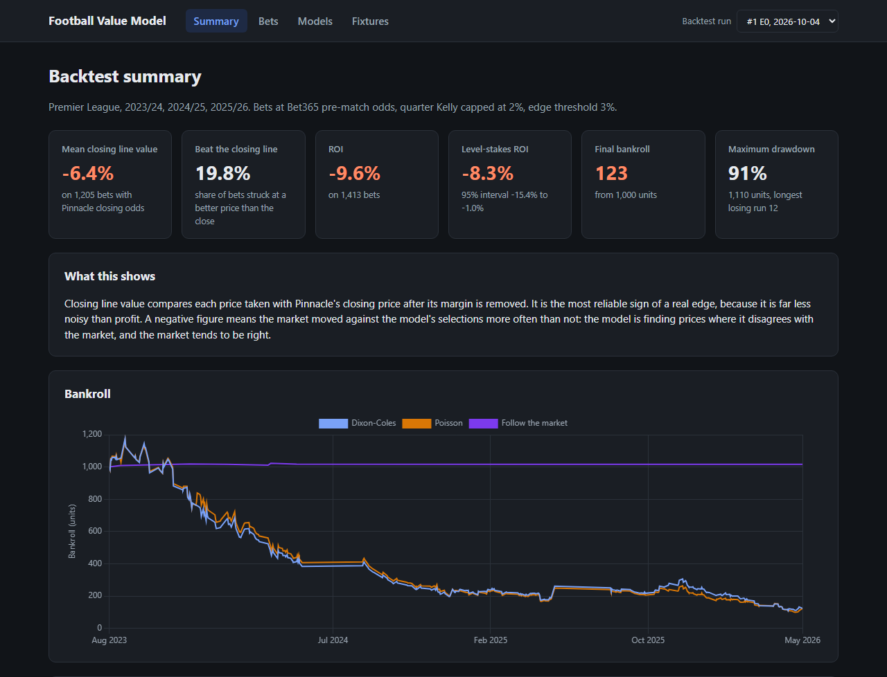
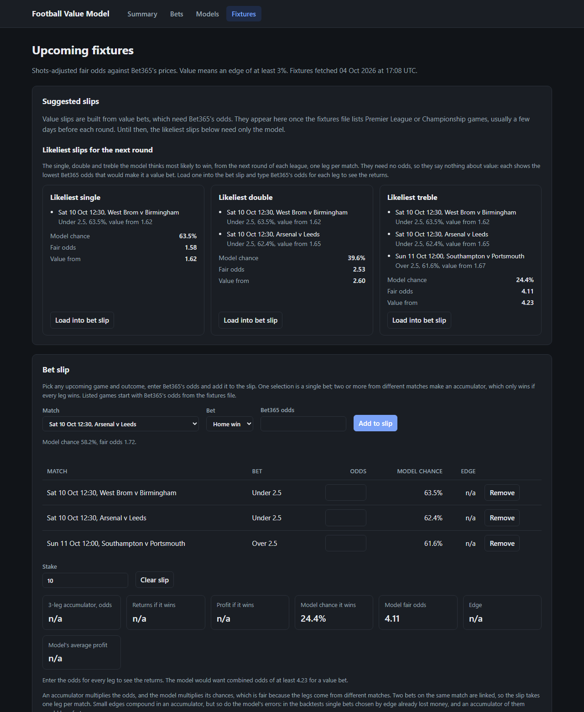
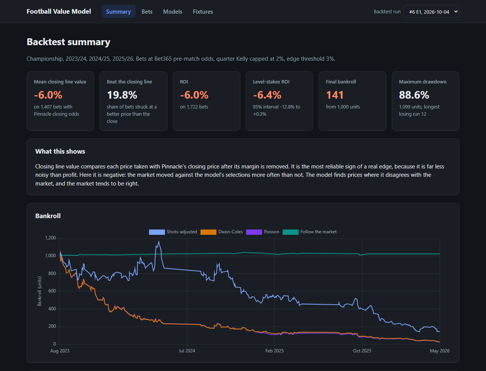

# Football Value Model

A football model that prices matches from goals and shots, compares its prices with bookmaker odds and tests the result with an honest walk-forward backtest. Paper trading only.



## Results in brief

The model does not beat the market. The main model learns team strengths from both goals and shot-based expected goals. Over three Premier League seasons, 2023/24 to 2025/26, it placed 1,407 paper bets at Bet365's pre-match prices. On average those prices were 6.8% worse than Pinnacle's closing line, only one bet in five beat the close, and the bankroll fell from 1,000 to 151 units. It forecasts slightly better than a classic Dixon-Coles model fitted to goals alone and is well calibrated, but the bookmakers' own prices are better forecasts still. The same holds in the Championship, where shots help more but the model still has no edge. Teams keep their ratings when they move between divisions, so promoted and relegated sides are priced from their first game. The full method and figures are in [Backtest](#backtest).

## How the model works

Each team gets two numbers: an attack strength and a defence strength. A team's expected goals in a match come from its own attack, the opponent's defence and, for the home side, a home advantage term shared by the whole league. Goals are treated as Poisson counts, which gives a probability for every scoreline up to 10 goals each. Adding up the right scorelines gives the chances of a home win, a draw, an away win, and over or under 2.5 goals.

That is the baseline Poisson model. Dixon and Coles (1997) noticed that real football has slightly different numbers of 0-0, 1-0, 0-1 and 1-1 results than independent Poisson counts predict, and added one parameter, rho, to correct those four scores. That is the classic model for football scores, kept here for comparison. On recent Premier League data the fitted rho is small and unstable: across the backtest it drifts between about -0.11 and +0.08, changing sign along the way. In practice the two models give almost the same prices. The main model goes a step further and also learns from shots, as described below.

The models are fitted by maximum likelihood with `scipy.optimize` and an analytic gradient. The attack strengths are constrained to sum to zero so the fit has a single answer. Recent matches count for more than old ones: each match is weighted by `exp(-xi * days_ago)`, and matches more than three years old are left out. Fitting three seasons takes a few hundredths of a second, which matters because the backtest refits before every round of matches.

### Choosing the time decay

The decay rate `xi` was chosen by validation, not guesswork. The seasons are split so that nothing used to choose a setting is later reported as a backtest result:

| Seasons | Use |
| --- | --- |
| 2019/20 and 2020/21 | Training history only |
| 2021/22 and 2022/23 | Choosing settings |
| 2023/24 to 2025/26 | Backtest |

For each candidate `xi`, Dixon-Coles walked through 2021/22 and 2022/23 on exactly the backtest's schedule, described below, refitting before each round of matches using only earlier results. Lower scores are better:

| `xi` per day | Log loss | Ranked probability score |
| --- | --- | --- |
| 0 | 0.98381 | 0.20504 |
| 0.001 | 0.97930 | 0.20335 |
| 0.002 | 0.97668 | 0.20230 |
| 0.003 | 0.97589 | 0.20187 |
| 0.004 | 0.97659 | 0.20193 |
| 0.005 | 0.97848 | 0.20238 |

Both scores are lowest at 0.003, so a match from about 230 days ago counts half as much as one played today. The Poisson baseline gives the same answer, and anything from about 0.0025 to 0.004 would give very similar forecasts. `valuemodel tune-xi --model dixon-coles` reproduces the table. The main model's time decay is chosen together with its use of shots, below.

### Shot-based expected goals

Goals are noisy: a side can dominate a match and lose it. Shots carry extra evidence about how strong each team is. football-data.co.uk records shots and shots on target, but not where or how each shot was taken, so these are not true expected goals. Instead, each shot on target and each other shot is worth the average number of goals that kind of shot led to in the training window. In recent Premier League seasons that is about 0.3 goals per shot on target and nothing for other shots. The values are kept non-negative, since otherwise a side with shots but none on target could be expected to score fewer than zero goals.

The main model, called shots-adjusted, fits each team's strengths to a blend of actual goals and these expected goals. Its time decay and the share of expected goals in the blend affect each other, so they were chosen together on the same tuning seasons:

| `xi` per day | Share of expected goals | Log loss | Ranked probability score |
| --- | --- | --- | --- |
| 0.005 | 0.5 | 0.96828 | 0.19975 |
| 0.005 | 0.6 | 0.96822 | 0.19971 |
| 0.005 | 0.7 | 0.96872 | 0.19985 |
| 0.006 | 0.5 | 0.96826 | 0.19975 |
| 0.006 | 0.6 | 0.96794 | 0.19963 |
| 0.006 | 0.7 | 0.96826 | 0.19972 |
| 0.007 | 0.5 | 0.96871 | 0.19991 |
| 0.007 | 0.6 | 0.96817 | 0.19973 |
| 0.007 | 0.7 | 0.96831 | 0.19976 |

Wider searches found nothing better, and fitting goals only or expected goals only was clearly worse (ranked probability scores of 0.2023 and 0.2014 at an `xi` of 0.005). A 60% share of expected goals and an `xi` of 0.006 forecast best, so a match about 115 days old counts half as much as one played today. Shots are less noisy than goals, so recent matches can safely count for more than in the goal-only models. `valuemodel tune-xi` and `valuemodel tune-shots` reproduce the search one setting at a time. The Dixon-Coles correction only applies to whole-number scores, so it has nothing to act on with a blend, and this model is fitted as Poisson.

### Teams that change division

Every season three teams are promoted to the Premier League and three are relegated from it. A model fitted on one league knows nothing about a promoted side, so it used to skip that team's first 10 games. Instead, each league is now fitted together with the division below it, and the Championship with League One as well. The two divisions never play each other, but the six teams that move between them each season put every team on one scale, so a promoted side starts with the ratings it earned in the Championship. League One is downloaded only for this purpose. Its own matches are never priced, because the model was never tuned or tested on them.

The linked leagues share one home advantage. From 2019/20 to 2025/26 it was 0.19 in the Premier League, 0.21 in the Championship and 0.22 in League One (the log of home goals over away goals), while it ranged from 0.06 to 0.29 between seasons of the same league.

This was checked on the tuning seasons before it was adopted, comparing the main model fitted on one league with the linked fit:

| 2021/22 and 2022/23 | Premier League | Championship |
| --- | --- | --- |
| Ranked probability score where both priced, one league | 0.1996 | 0.2224 |
| Same matches, linked | 0.1980 | 0.2216 |
| Newly priced matches, linked | 0.2136 (20 matches) | 0.2147 (49 matches) |
| Same new matches, Pinnacle's closing odds | 0.2224 | 0.2150 |

The linked fit forecast better on the matches both versions priced, and about as well as the closing odds on the matches only it could price. Teams new to a league won slightly fewer points than it expected (0.97 a game against 0.98 in the Premier League, 1.40 against 1.42 in the Championship), no worse than the market did, so no correction for promoted teams was added. `--single-league` on `valuemodel backtest`, `tune-xi` and `tune-shots` fits one league alone, for comparison.

### Finding value and staking

A bookmaker's odds imply a probability of `1 / odds` for each outcome. Those probabilities add up to more than 1, and the excess is the bookmaker's margin. When the market is used as a forecast, the margin is removed with either the proportional method, which scales every outcome down by the same factor, or the power method, which raises every implied probability to the same exponent and so takes more off longshots. Bookmakers tend to load their margin onto unlikely outcomes, so the power method is the default.

A bet has value when `model probability * odds - 1` is at least the edge threshold, 3% by default. This uses the odds actually on offer, margin included, because that is the price a bet would be struck at. At most one bet is taken per market per match: the outcome with the biggest edge in the match result, and the same in over/under 2.5 goals.

Stakes are paper only. The default is quarter Kelly, a quarter of the stake the Kelly criterion recommends, because full Kelly assumes the model's probabilities are exactly right. Flat staking is the alternative. Either way no single bet can exceed 2% of the current bankroll, and nothing is staked without a positive edge.

## Quick start

You need Python 3.12 or later.

```bash
git clone https://github.com/Jatzo/football-value-model.git
cd football-value-model
python -m venv .venv
source .venv/bin/activate
pip install -e ".[dev]"
valuemodel download
pytest
```

On Windows, activate the environment with `.venv\Scripts\activate` instead.

`valuemodel download` fetches the Premier League and the Championship from 2019/20 to 2025/26, waiting a couple of seconds between files, and caches them in `data/raw/` so later runs do not touch the network. Use `--leagues`, `--seasons` and `--refresh` to change what is fetched. A Championship backtest also needs League One: `valuemodel download --leagues E2`.

Run the backtest, which prints the report below and saves the run to `data/valuemodel.sqlite`:

```bash
valuemodel backtest
```

Price a single match, optionally against a bookmaker's decimal odds to see the edge and the paper stake. Team names are spelt as the data source spells them, for example `Man United` and `Nott'm Forest`:

```bash
valuemodel predict --home Arsenal --away Chelsea
valuemodel predict --home Arsenal --away Chelsea --odds 1.70 3.90 5.25 --totals-odds 1.95 1.95
```

List the paper bets on upcoming games. `valuemodel fixtures` fetches the latest fixtures, results and season schedules, and `valuemodel picks` ranks every listed game where Bet365's odds beat the model's fair odds by at least 3%, biggest edge first, with its paper stake. It also prints, for the next round of each league, the lowest Bet365 odds at which each outcome would be a value bet, so games the fixtures file does not list yet can be checked against the bookmaker by hand:

```bash
valuemodel fixtures
valuemodel picks
```

`valuemodel slips` suggests the three best slips of a chosen size that can be built from those paper bets: the combinations of value bets from different matches with the highest combined edge, each with a paper stake at its combined odds. The size runs from a single to a six-fold, set with `--legs` (a treble by default), and `--bet` keeps every leg to one bet type: match result, over/under 2.5 goals or both teams to score. Sizes are chosen rather than ranked against each other, because when every leg has an edge, adding legs always raises the combined edge while cutting the chance of winning, so the biggest accumulator would always come out on top. The three options often share legs, the second and third usually swapping one leg for the next best choice. Finding them takes a short exact search rather than trying every combination, which a test checks against trying every combination.

Value slips need odds, so they only appear once the fixtures file lists the round. Before that, `valuemodel slips` and the fixtures page offer the three likeliest slips of the same size from the next round of each league, one leg per match, with the model's chance, its fair odds and the lowest Bet365 odds that would make the slip a value bet. With any bet type allowed these are mostly goals bets, because few match results reach a 60% chance, so choosing match result gives the likeliest wins instead. The likeliest slips can also use both teams to score, which the model prices from the same scorelines as the chance that each side scores at least once. The fixtures file has no odds for that market, so it never appears in value slips or the backtest. Loading a slip into the bet slip leaves the odds for you to type in from the bookmaker.

### Dashboard

```bash
valuemodel fixtures
flask --app valuemodel.web run
```

Then open http://127.0.0.1:5000. The summary page leads with closing line value and shows a bankroll chart for each strategy. The bets page has the full bet log with filters for strategy, league, season, market and result. The models page compares the forecasters and shows a calibration chart. The fixtures page starts with the same ranked paper bets, each with a box to type a stake and see what it would return, followed by the three best suggested slips for a chosen number of legs, from one to six, and a chosen bet type, each of which loads into the bet slip with one click. It then prices upcoming matches next to Bet365's odds, highlights value, and lists each match's most likely result in order of the model's confidence. A bet slip takes any upcoming game, outcome and odds, or a paper bet with one click. One selection is a single; two or more make an accumulator, whose odds and model chances multiply. The slip shows the combined odds, the return and profit for a stake, the model's chance that every leg wins, the edge, and whether it counts as value. It takes one leg per match, because outcomes of the same match are linked and their chances cannot simply be multiplied. Below that, a season schedule section gives the model's chances, fair odds, prices to beat, the chance both teams score and expected goals for the next few rounds of the Premier League and Championship, or every remaining round. It has no odds, so it is the model's view of what might happen rather than a list of bets, and games further ahead use today's team ratings. The bets page can also be ordered by the model's chance of each bet winning.



The screenshot shows the three likeliest trebles for the round after 4 October 2026, before the fixtures file listed any odds, with the first loaded into the bet slip and waiting for Bet365's prices.

The dashboard only reads the local database and cached files. `valuemodel fixtures` is what fetches the latest fixtures file, refreshes this season's results and downloads the season schedules, for the Premier League and the Championship unless `--leagues` says otherwise. The fixtures file covers many leagues but only the next few days, once bookmakers have priced the games, and the model can only price leagues it has results for. The schedules cover the whole season. Charts use Chart.js from a CDN, so they need an internet connection.

### Development

```bash
pytest
ruff check .
ruff format --check .
```

GitHub Actions runs the same checks on every push and pull request. The code is organised as follows:

| Module | Purpose |
| --- | --- |
| `cli.py`, `config.py` | The `valuemodel` command, settings, leagues and seasons |
| `data.py`, `teams.py`, `fixtures.py`, `schedule.py` | Downloading, caching, cleaning and standardising results, odds, upcoming fixtures and season schedules |
| `models/`, `expected_goals.py` | Poisson, Dixon-Coles and shots-adjusted models with time decay, and shot-based expected goals |
| `markets.py`, `odds.py`, `staking.py`, `picks.py` | Market probabilities, margin removal, value detection, stakes, upcoming paper bets and prices to beat |
| `walkforward.py`, `tuning.py`, `backtest.py` | Walk-forward forecasting, choosing settings, and the backtest metrics |
| `store.py`, `report.py`, `labels.py`, `web/` | SQLite storage, the text report, shared display formats and the dashboard |

## Configuration

Settings come from environment variables. Copy `.env.example` to `.env` to change them.

| Variable | Default | Meaning |
| --- | --- | --- |
| `VALUEMODEL_DATA_DIR` | `data` | Where downloaded files and the database are kept |
| `VALUEMODEL_REQUEST_DELAY` | `2` | Seconds to wait between downloads |
| `VALUEMODEL_MARGIN_METHOD` | `power` | How the margin is removed: `power` or `proportional` |
| `VALUEMODEL_EDGE_THRESHOLD` | `0.03` | Smallest edge that counts as value |
| `VALUEMODEL_STAKING` | `kelly` | `kelly` or `flat` |
| `VALUEMODEL_KELLY_FRACTION` | `0.25` | Share of the full Kelly stake to use |
| `VALUEMODEL_MAX_STAKE` | `0.02` | Largest stake on one bet, as a share of the current bankroll |
| `VALUEMODEL_FLAT_STAKE` | `0.01` | Flat stake, as a share of the starting bankroll |
| `VALUEMODEL_STARTING_BANKROLL` | `1000` | Starting bankroll in units |
| `VALUEMODEL_BOOKMAKER` | `b365` | Whose pre-match prices bets are taken at: `b365` or `pinnacle`. With `pinnacle` the follow-the-market strategy is skipped |

## Backtest

### Method

The backtest walks through 2023/24, 2024/25 and 2025/26 in date order. Before each round of matches the model is refitted using only results that were known when the bookmaker's odds were collected. The data source collects pre-match odds on Friday afternoon for games from Friday to Monday, and on Tuesday afternoon for games from Tuesday to Thursday, so a Sunday match is priced from results up to the Thursday before it, never from Saturday's games. A test rewrites every result after a cutoff date and checks that no forecast made before the cutoff changes.

Bets are struck at Bet365's pre-match price whenever the edge reaches 3%, with quarter Kelly stakes capped at 2% of the bankroll. All stakes on one day are sized from that morning's bankroll. Every model is fitted on the league's linked divisions as described above. Games involving a team with fewer than 10 matches in the training window, in any linked league, are skipped.

Four strategies are compared: the main shots-adjusted model, Dixon-Coles, the Poisson baseline, and following the market. The last treats Pinnacle's pre-match prices, with the margin removed, as its forecast, and bets whenever Bet365 offers at least 3% more.

### Closing line value

Closing line value (CLV) compares the price taken with Pinnacle's closing price after its margin is removed. Pinnacle's closing line is widely treated as the most accurate price available, so a bettor with a real edge should usually beat it. CLV is far less noisy than profit, which makes it the most honest single measure here. It is a benchmark only: closing odds never decide a bet or its stake.

| Strategy | Bets | Bets with closing odds | Mean CLV | Beat the close |
| --- | --- | --- | --- | --- |
| Shots-adjusted | 1,407 | 1,168 | -6.8% | 20.2% |
| Dixon-Coles | 1,389 | 1,178 | -6.3% | 20.6% |
| Poisson | 1,397 | 1,186 | -6.3% | 20.6% |
| Follow the market | 7 | 7 | -4.4% | 57.1% |

For context, backing every Bet365 price in these seasons without any model gives a mean CLV of between -4.9% and -8.6%, depending on the outcome. The model's selections are no better than that. It finds prices where it disagrees with the market, and the market turns out to be right more often than not. Pinnacle's odds are missing from 17 January 2026 onwards, which is why about 17% of bets have no closing price to compare with.

### Betting results

| Strategy | Bets | Staked | Profit | ROI | Max drawdown | Level-stakes ROI (95% interval) |
| --- | --- | --- | --- | --- | --- | --- |
| Shots-adjusted | 1,407 | 7,364 | -849 | -11.5% | 88% | -7.4% (-15.4% to +0.6%) |
| Dixon-Coles | 1,389 | 6,855 | -932 | -13.6% | 95% | -10.6% (-17.3% to -3.1%) |
| Poisson | 1,397 | 7,316 | -924 | -12.6% | 94% | -10.2% (-17.2% to -2.7%) |
| Follow the market | 7 | 21 | +17 | +79.3% | 1% | +125% (-43% to +350%) |

Starting from 1,000 units, the main model finished with 151, Dixon-Coles with 68 and Poisson with 76. Level-stakes ROI puts one unit on every bet, which removes the effect of the order in which results arrived. The interval comes from resampling the bets. For Dixon-Coles and Poisson it sits entirely below zero. For the main model it just reaches above zero, but its closing line value is no better, so the smaller loss is most likely luck rather than a real edge. The market strategy found only seven bets, too few to mean anything, which itself shows how rarely Bet365 is 3% more generous than Pinnacle.

### Model quality

Scored on the 970 matches that every forecaster priced. Lower is better for all three scores.

| Forecaster | Log loss | Ranked probability score | Brier |
| --- | --- | --- | --- |
| Shots-adjusted | 0.9665 | 0.1972 | 0.5737 |
| Dixon-Coles | 0.9684 | 0.1981 | 0.5756 |
| Poisson | 0.9686 | 0.1981 | 0.5758 |
| Bet365 pre-match, margin removed | 0.9499 | 0.1922 | 0.5635 |
| Pinnacle closing, margin removed | 0.9441 | 0.1905 | 0.5590 |

The models are well calibrated: when the main model gives an outcome a 25% chance, it happens about a quarter of the time. But the market's forecasts are sharper. A model built only from past scores knows nothing about injuries, suspensions, managerial changes or team news, all of which the market prices in. That gap is the most likely reason the model loses. Adding shots narrows it only slightly: on seasons it was never tuned on, the main model beats Dixon-Coles on all three scores. Its tuned shot settings did a little worse on these seasons than the even blend first tried. That is a normal cost of tuning on limited data, and the tuned settings are kept, since switching after seeing these results would mean tuning on the test seasons.

### Bets by the model's chance of winning

The bets each model was surest about win most often, but at short odds. For the main model:

| Model's chance | Bets | Average chance | Won | Level-stakes ROI |
| --- | --- | --- | --- | --- |
| Under 30% | 429 | 20.7% | 14.7% | -16.5% |
| 30% to 45% | 403 | 37.8% | 34.2% | +5.9% |
| 45% to 60% | 444 | 52.3% | 42.8% | -9.2% |
| Over 60% | 131 | 65.7% | 52.7% | -12.7% |

In every band the bets won less often than the model expected, and the bets it was most confident about did no better than the rest. That is a selection effect: value bets are chosen where the model disagrees with the market, and on exactly those matches the model is overconfident. The 30% to 45% band happened to make money, but picking out one profitable band after the event is how backtests mislead, so it is not treated as a finding.

### Teams that change division, on the backtest seasons

The same comparison on the backtest seasons went the other way, slightly:

| 2023/24 to 2025/26 | Premier League | Championship |
| --- | --- | --- |
| Ranked probability score where both priced, one league | 0.1962 | 0.2155 |
| Same matches, linked | 0.1969 | 0.2162 |
| Newly priced matches, linked | 0.2046 (30 matches) | 0.1982 (84 matches) |
| Same new matches, Pinnacle's closing odds | 0.1854 | 0.2001 |

Most of the difference comes from promoted Premier League sides. Seven of the nine promoted in these seasons went straight back down, and they won 0.65 points a game against the 0.87 the linked model expected. The market expected 0.82, so it overrated them too, but less. Promoted teams often look stronger on their Championship form than they prove to be. The linked fit is kept, because it was chosen on the tuning seasons, and switching after seeing these results would mean tuning on the test seasons. A correction for promoted teams would need more seasons than these three to estimate fairly.

### Championship

The same backtest was run on the Championship, with every setting left exactly as tuned on the Premier League. The model never saw Championship data while its settings were chosen, which makes this a clean out-of-sample test. To reproduce it, run `valuemodel download --leagues E1 E2` and then `valuemodel backtest --league E1`.



| Strategy | Bets | Mean CLV | Beat the close | ROI | Final bankroll | Level-stakes ROI (95% interval) |
| --- | --- | --- | --- | --- | --- | --- |
| Shots-adjusted | 1,722 | -6.0% | 19.8% | -6.0% | 141 | -6.4% (-12.8% to +0.3%) |
| Dixon-Coles | 1,883 | -6.0% | 18.8% | -14.0% | 29 | -10.2% (-16.1% to -4.2%) |
| Poisson | 1,892 | -6.1% | 18.7% | -14.1% | 26 | -10.9% (-17.0% to -4.5%) |
| Follow the market | 23 | +2.1% | 65.2% | +20.2% | 1,023 | +46.6% (-42.4% to +156.1%) |

| Forecaster | Log loss | Ranked probability score | Brier |
| --- | --- | --- | --- |
| Shots-adjusted | 1.0340 | 0.2151 | 0.6218 |
| Dixon-Coles | 1.0392 | 0.2170 | 0.6256 |
| Poisson | 1.0393 | 0.2170 | 0.6256 |
| Bet365 pre-match, margin removed | 1.0286 | 0.2133 | 0.6180 |
| Pinnacle closing, margin removed | 1.0242 | 0.2120 | 0.6149 |

Shots help more here than in the Premier League. The main model beats Dixon-Coles on all three scores, by 0.0019 in ranked probability score against 0.0009 in the Premier League, and its forecasts come closer to Bet365's. The Championship market is probably priced less sharply than the Premier League. The verdict is still the same, though: a mean closing line value of -6.0% means the prices taken were worse than where the market closed, so the model has no edge. The market strategy's positive closing line value comes from only 23 bets, too few to read anything into.

## Limitations

**Data quality.** Results and odds come from one free source whose column names, date formats and encodings have changed over the years. The loader maps every era onto one schema and is tested against real extracts from 2005/06, 2015/16 and 2025/26. Rows that fail basic checks, such as a result that does not match the score, are logged and left out rather than corrected by guesswork. Most of 2020/21 was played without crowds and home advantage almost disappeared. Those matches are only used as training history, and time decay gives them little weight by the time any forecast is scored.

**When the odds were captured.** The pre-match odds are a single snapshot taken on Friday or Tuesday afternoon, roughly a day before kick-off. They are not the price available at any chosen moment, and the backtest assumes every stake could have been placed at that snapshot.

**Promoted teams.** A newly promoted side is rated from its results in the division below, which says nothing about the players it signs over the summer. In the backtest seasons the model overrated promoted Premier League sides, as described above. A team with fewer than 10 matches across the linked leagues in the training window is still flagged and its games are not priced or bet on, which now only happens to a side coming up from below League One.

**Backtests are not real betting.** Bookmakers limit accounts that win, prices move once money arrives, and the gap between a backtest and real results is almost always unfavourable. Here the backtest already loses, so this mostly matters as a warning against reading anything into the market strategy's seven bets.

## Not betting advice

This is a statistics project. It does not place bets and nothing in it is a recommendation to gamble. If gambling is causing you problems, [BeGambleAware](https://www.begambleaware.org/) offers free, confidential support.

## Credits

Results and odds from [football-data.co.uk](https://www.football-data.co.uk/). Season schedules from [openfootball](https://github.com/openfootball/football.json), published into the public domain. The model follows Dixon, M. J. and Coles, S. G. (1997), "Modelling association football scores and inefficiencies in the football betting market", *Journal of the Royal Statistical Society: Series C (Applied Statistics)*, 46(2), 265 to 280.

## Licence

MIT. See [LICENSE](LICENSE).

## Technical skills

| Area | Skills used in this project |
| --- | --- |
| Python | Python 3.12, type hints throughout, dataclasses, generics, packaging with `pyproject.toml` and a console script |
| Statistical modelling | Poisson regression, the Dixon-Coles model, maximum likelihood estimation with analytic gradients, L-BFGS-B optimisation with SciPy, identifiability constraints, exponential time decay, shot-based expected goals with non-negative least squares |
| Model evaluation | Walk-forward validation, choosing a hyperparameter on held-out seasons, log loss, Brier score, ranked probability score, calibration analysis, bootstrap confidence intervals |
| Betting maths | Implied probabilities, margin removal by the proportional and power methods, expected value, fractional Kelly staking with a cap, closing line value, drawdown and losing run analysis |
| Backtesting | Point-in-time refitting with no lookahead, separate tuning and test periods, realistic odds timing, comparison against simple baselines |
| Data engineering | pandas and NumPy vectorisation, cleaning CSV files whose columns, encodings and date formats changed over 20 years, validation of every row, a polite HTTP client with httpx, caching and atomic file writes |
| Storage | SQLite through the standard library, schema design, transactions, foreign keys, older saved runs that still load after the settings change |
| Web | Flask with an app factory and blueprint, Jinja templates and filters, Chart.js, plain JavaScript, responsive CSS with light and dark modes, subresource integrity |
| Command line | argparse subcommands, input validation with clear error messages, close-match suggestions for misspelt names |
| Testing | pytest with fixtures and parametrisation, simulation tests that recover known parameters, gradient checks, a test proven to catch lookahead, mocked HTTP, Flask's test client, fixtures cut from real data files |
| Engineering practice | ruff for linting and formatting, GitHub Actions CI, configuration through environment variables, small focused commits |
